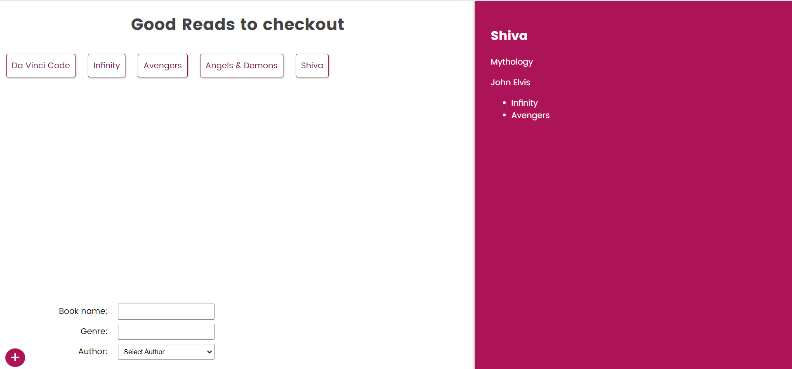

# Getting Started
- Once the repository is downloaded, create a <i>.config</i> file & paste the following contents
    ```
    user:<user>
    pwd:<pwd>
    ```

- Replace \<user\> & \<pwd\> with your credentials for monngo db cluster at atlas
- Make sure that you have a learn-graphql named db present in that cluster

- open terminal in server folder and type npm i
- npm run start
- Your server should be up and running

- open terminal in client folder and type npm i
- npm run start
- Your react app should be running

<h4>Screenshot of the App</h4>
